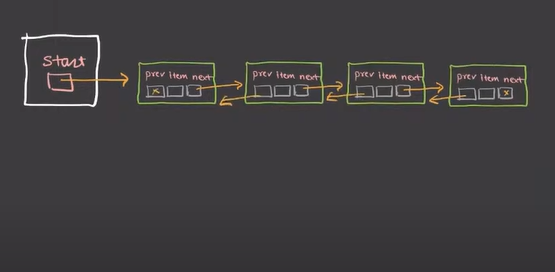
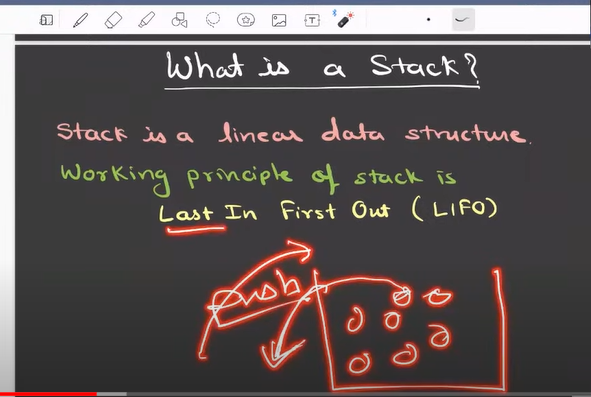
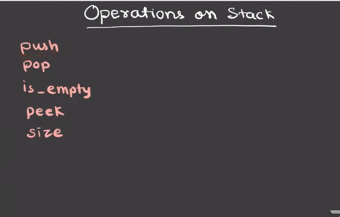
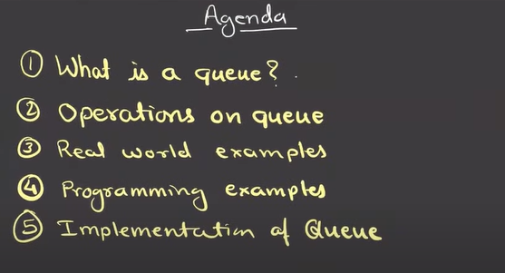
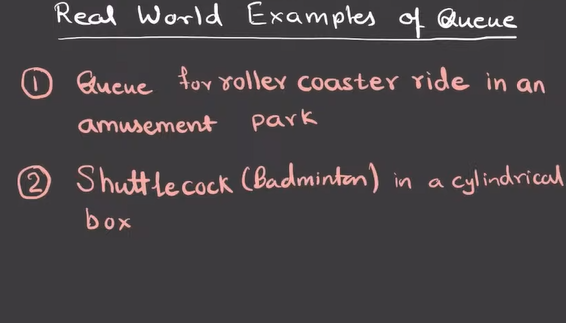
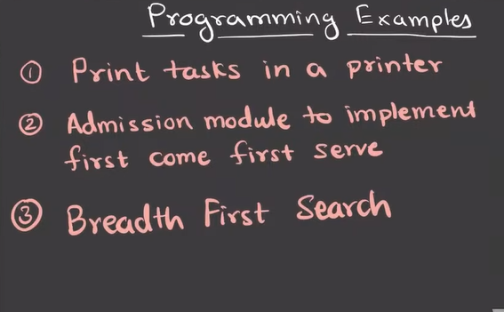
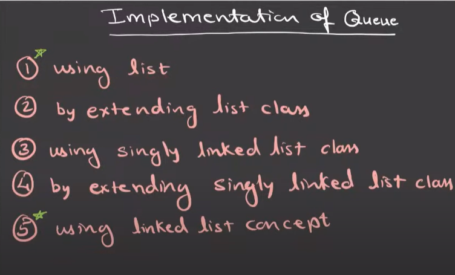
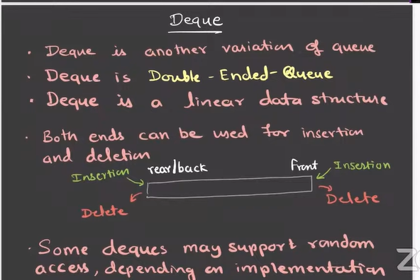

# Python_Leetcode 
python is dynamically typed langauage ........datatype is deceided while run time

## Array
Array- collection of similar type of data like if one is integer  rest of the object will be integer general perspective its is not growable ...length of the array is fixed 

2) we can store only homogenious values in array where as in list u can store hetrogenous value

3) in array class we will have many function 
appemd()
count()
extend() 
insert()
remove() in remove we have to mention value 
reverse()
tolist()
pop() in pop we will mention index

difference btw array and dyanamic array
array:
fixed size
indexed
collection of same type elements.

dynamic array:
collection of diiferent type element
resizable
indexed

## List
fromlist--- we can  make list to array
tolist-----we can make array to list

list is predefined class its in buildins data structure  ,its also elementaray datatype provide by python

2) list is growable

3) mutable eg at certain index we can add or remove that type of thing

4) list is also called as dynamic array

## Numpy
if you want to perform mathematical calculations, then you shoukd use NumPy arrays by importing NumPy package

2) in NumPy array size is fixed

3) pip install numpy

## class and object 
eg -in real world common noun such as docter is class where as dr shashank is proper noun it will be an object 

class is a group of variable and function

class is a way to implement encapsulation
object can be made if we dont have class 
class is like a blueprint of an object  

what ever member variable and member function you will create in class is called as Attribute

Object 

object is an instance of a class 
instance means an example 

in python we have two type of object 
1) class object
2) Instance Object

to create a new object in python we dont need new keyword

In class we can make 3 type of function 
Instance method 
static method
classs method

##  elementary operation for DLL
Inserting
deletion
traversing
searching
checking the empty list

# DLL basic structure and key note is that we can traverse back in DLL not in SLL

we have a object in DLL class that will be our start in start we have reference of first node that contain prev,item,next in the first nodes next we have next nodes reference 

and last node prev conatin previous node reference and in first node prev we have None check the image  below 

## Stack
stack is linear(logically they are in sequence) data structure and working priciple of stack is last in first out (LIFO)

fundamental operation 

push- to add in stack
pop- to remove added elements in stack
is_empty is function to check if stack is empty or not
peek-shows which elements is in top 
size function - to check the size of the paticular data structure

# Queue

Queue is a linear data structure working principle of stack is first in first out

# operations on queue
enqueue-insertion
dequeue-deletion
is_empty
get_front
get_rear
size

# Deque 
Deque is another variation of queue 
Deque is Double-Ended-Queue
Deque is a linear data structure
Both ends can be used for insertion  and deletion 

In some cases we can access the element from middle too