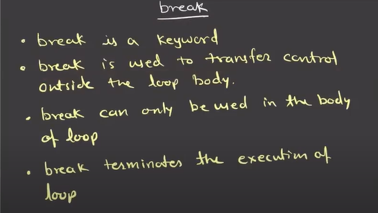

Type of object
instance object
function object
class object

object is something which can store data and store data and has methods (functions) to handle data 

module
.py file is a module 
module contains python code with three king of reusable elements 
1) variable
2) functions
3) classes

keywords 
1) predefined
2) reserved words 

operators
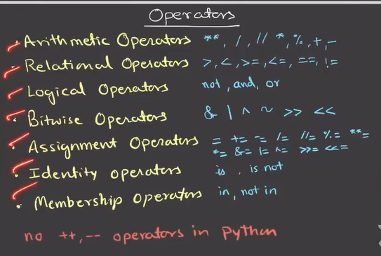

Type conversion 
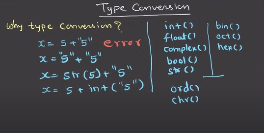

Loop
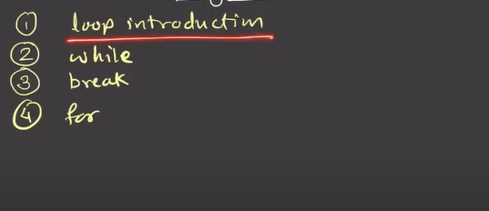
we dont ahve do while loop in python we have only while and for 

while condition:
     code 
     code 
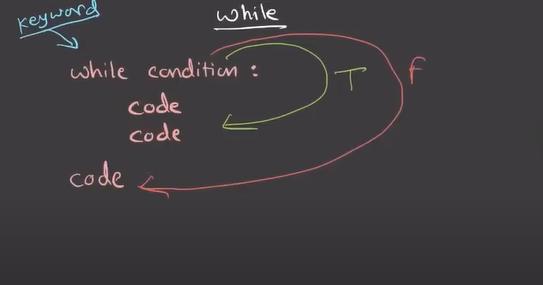

break keyword

for loop
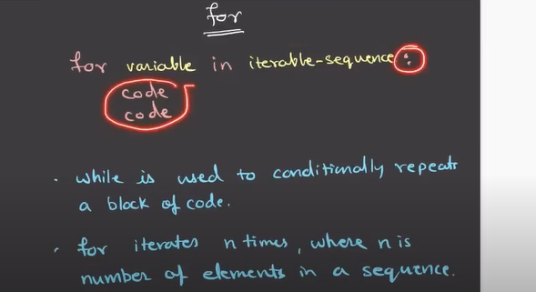

what are iterables
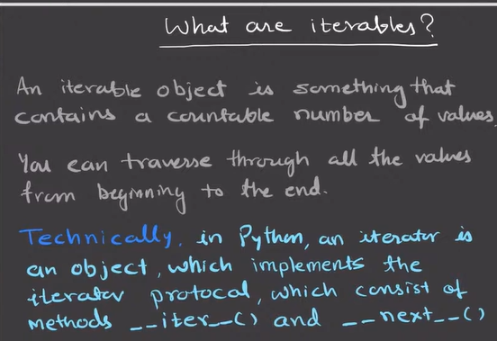

various iterables

Range
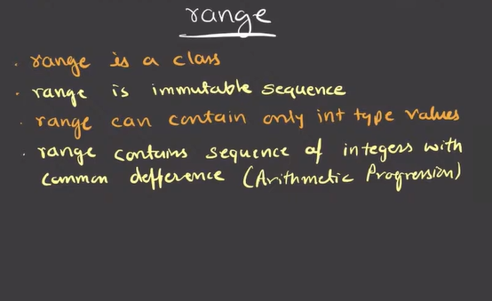
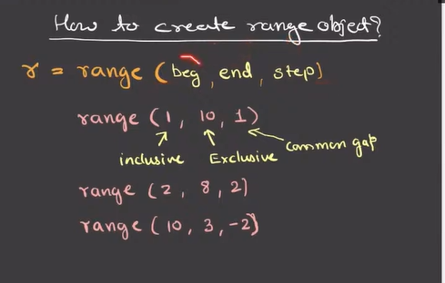
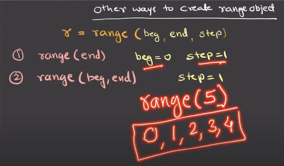

list is similar to  array

difference is in list we can store hetrogenous data eg int,int,float but in array we can all data should be same 

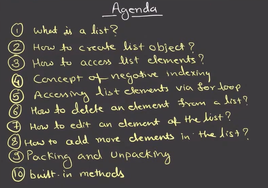
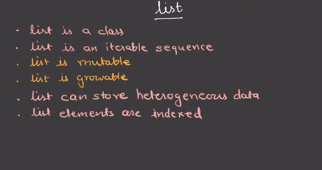

how to create list obect 
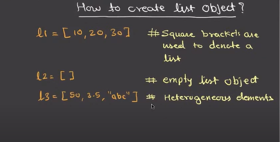

Concept of negative indexing
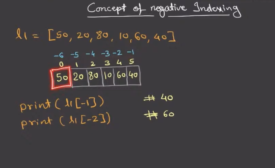

how to add elements in list 
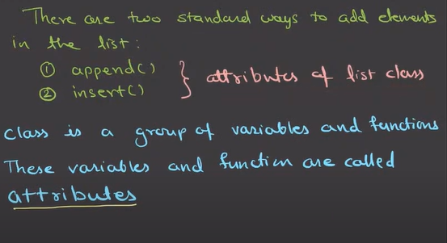
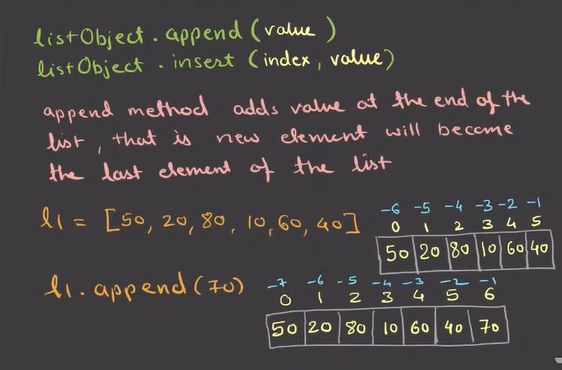

Packing and Unpacking
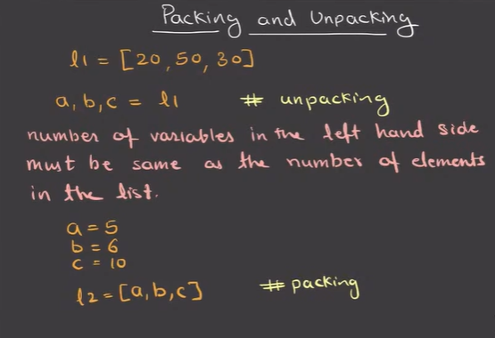

Built in methods which can  be implemented on any iterables like  str ,range,set,tuple,dict
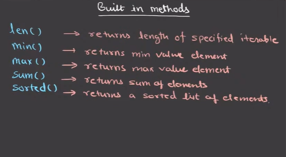

list() methods -we can use this methods and pass only one argument  
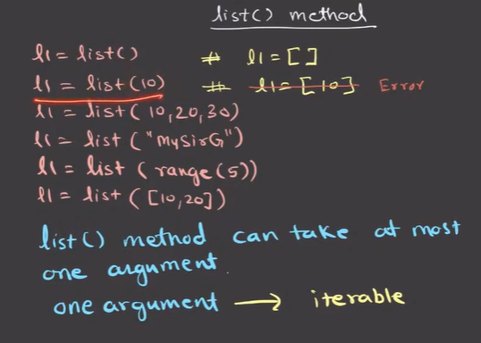

comparison operator on list
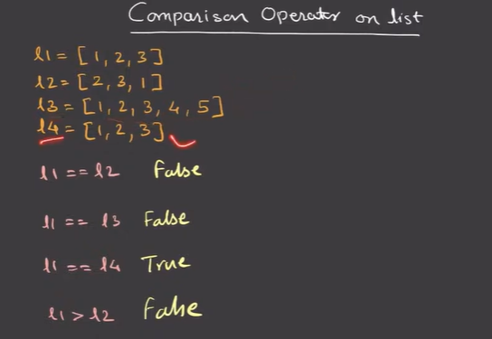

concatenation operator 
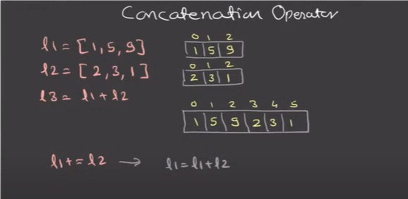

str class
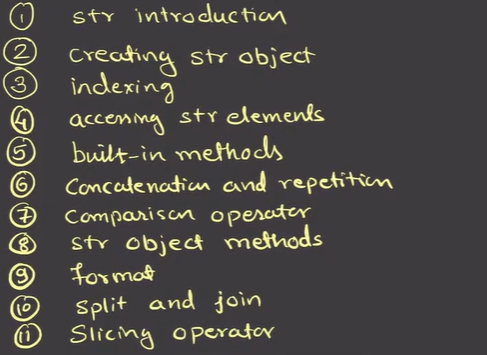
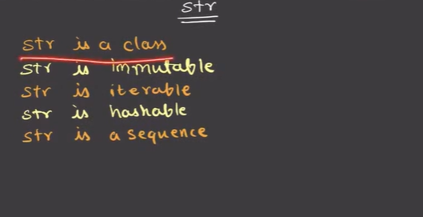
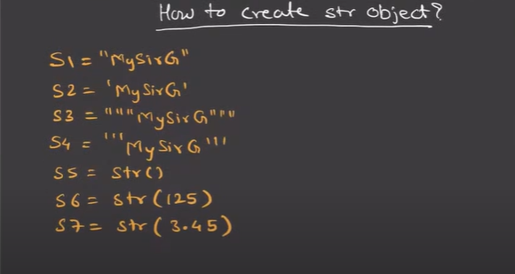

set-iterables-
set is mutable 
indexing is not applicable 
cant have duplicates 
slicing operator is not applicable

Procedure(function) oriented programming
python supports object oriented approach of programming

class---common noun(Teacher)
object---proper noun(John)
state----set of values store in an object
