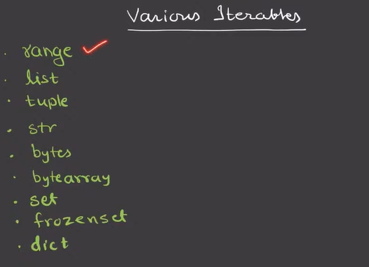
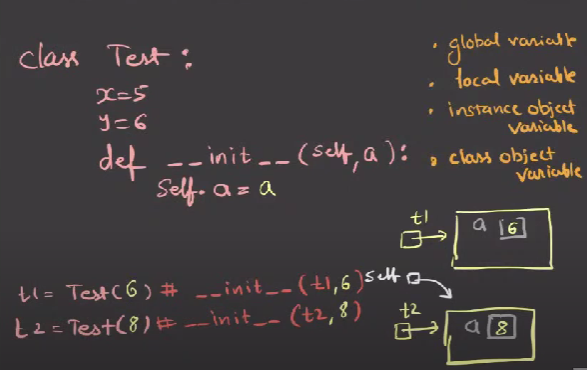
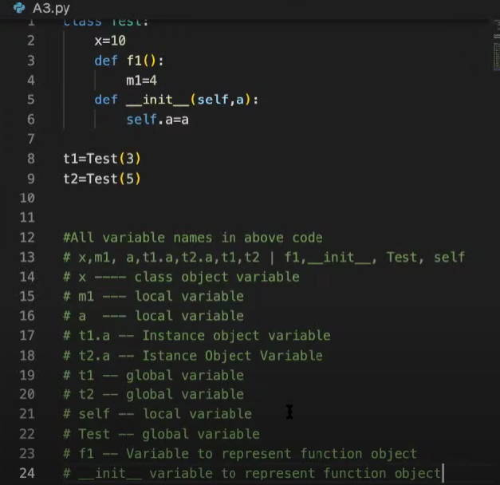
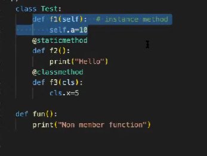

Type of object
instance object
function object
class object

object is something which can store data and store data and has methods (functions) to handle data 

module
.py file is a module 
module contains python code with three king of reusable elements 
1) variable
2) functions
3) classes

keywords 
1) predefined
2) reserved words 

operators

Type conversion 

Loop

we dont ahve do while loop in python we have only while and for 

while condition:
     code 
     code 

break keyword

for loop

what are iterables

various iterables

Range

list is similar to  array

difference is in list we can store hetrogenous data eg int,int,float but in array we can all data should be same 

how to create list obect 

Concept of negative indexing

how to add elements in list 

Packing and Unpacking

Built in methods which can  be implemented on any iterables like  str ,range,set,tuple,dict

list() methods -we can use this methods and pass only one argument  

comparison operator on list

concatenation operator 

str class

set-iterables-
set is mutable 
indexing is not applicable 
cant have duplicates 
slicing operator is not applicable

Procedure(function) oriented programming
python supports object oriented approach of programming

class---common noun(Teacher)
object---proper noun(John)
state----set of values store in an object

Encapsulation-act od combining properties and methofs related to the same entity
student is a class
in that we have properties-name ,rollno,sid,section methods-changesection(),promote class(),enrollstudent() 
properties and methods together is called as attributes

Instance object and class object

if class name is test then class object name is test --when you create a class then you are atomatically creating a class object then referencing variable will be same as class name 
there can be only one class object for a class

class test:  ---for this test class we have class object(test) in that we have x and y variable
x=5
y=9
def f1(:
print("hello"))

t1=test()-- we are craeting an instance object of test class which is empty at the time of creation
t2=test()

variable types 
-global variable
-local variable
-instance object variable
-class object variable

__init__() methods

class test:
x=5
y=9
def __init__(self): #init methosd takes min one arg that will be self 
self.a=4

t1=test()  # as soon as we call this instance object will be created and __init__(t1) is called now self is refering to t1 object the (a variabe is created in that and 4 is stored in side that)

Type of functions
instance methods
static methods
class method
non-member fucntions

create and access
instance object variable
1) through __init__ () via self
2) through instance object via self
3) through class object via instance object

class object variable
1) Inside the class
2) Through class name 